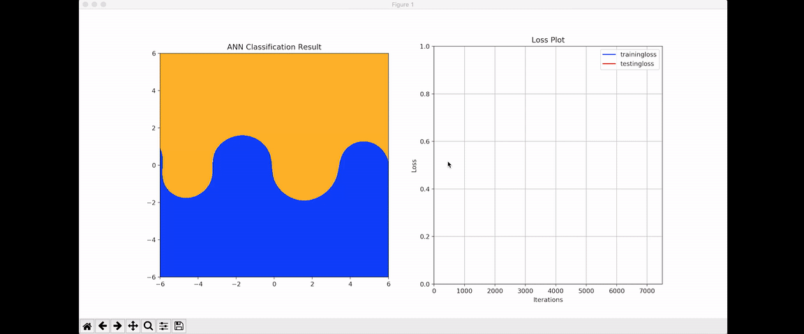

In this demo, I created a neural network with TensorFlow framework to classify the raster background image based on the Archimedean Spiral points data (7 values of each point are inputted in the NN: x, y, x^2, y^2, xy, sin(x) and sin(y)) we inputed to the NN as training data.

The idea is from the Neural Network Playground demo created by Google: http://playground.tensorflow.org/ I might use a different approach compared to their demo.

The Video of this demo can be accessed here: https://youtu.be/_Fhl6g7-pPY

Python Version needed: Python 3.5+  
Python modules needed 1. tensorflow; 2. numpy; 3. matplotlib; 4. numba

The demo looks like this:

